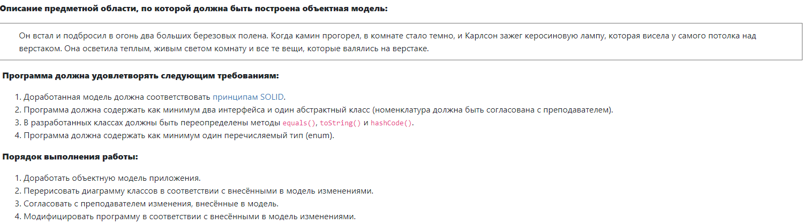

# В данном репозитории собраны лабораторные работы.
Лабораторная №1:

Лабораторная №3:

Полная объектная модель состоит из абстрактного класса - помещения, двух интерфейсов - освещение и отопление, которые напрямую связаны с помещением, типом enum, в зависимости от которого мы выбираем, нужную температуру в помещении.
